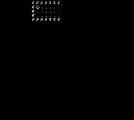
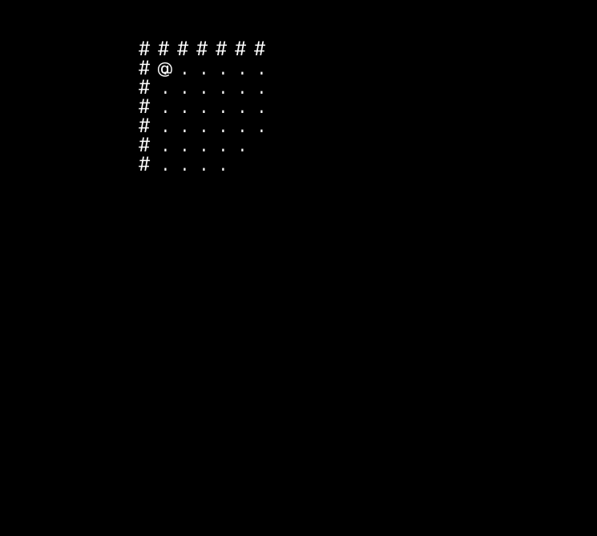

# go-fov
go-fov is meant to provide an easy-to-implement and (relatively) unobstrusive way to quickly add field of view to a 
top-down, grid-based game (it was made with traditional roguelikes in mind).

go-fov uses recursive shadowcasting to track the cells which are considered "visible." For a much better explanation on
the algorithm than I could ever provide, please see this [roguebasin article](http://www.roguebasin.com/index.php?title=FOV_using_recursive_shadowcasting)
or an absolutely wonderful technical explanation from [Gridbugs](https://gridbugs.org/visible-area-detection-recursive-shadowcast/)

## Installation
To use go-fov: 
`import "github.com/norendren/go-fov/fov"` and `go get` to acquire the dependency.

Or to retrieve it independently:
```
go get github.com/norendren/go-fov/fov
```

## Usage
go-fov is intended to be unassuming, while still providing the efficiency that recursive shadowcasting brings to FOV calculations

### Quickstart
If you can already tell go-fov trying to provide, you may not need a long-winded explanation, and the following
three steps will be enough to get you started:
1. Instantiate a `View` with `myFOVCalculator := fov.New()` and store it alongside your map and player data
2. Each time the player moves, call `myFOVCalculator.Compute(yourMap, playerXCoord, playerYCoord, radius)`
3. When drawing your map, check if the map coordinate is visible by calling `myFOVCalculator.IsVisible(x,y)`

And that's it!

---

### Requirements
Three things are required:
* An instance of the View struct, which represents the current "view" of the player at the time `Compute()` is called
* Your map must implement the `GridMap` interface, which only has two methods `InBounds` and `IsOpaque` used to determine
whether a given `x,y` coordinate is within the boundaries of your map and whether it is opaque and therefore blocks vision
* Each time position is changed, a call to `Compute()` must be made in order to update the set of visible cells

### Example Implementation
A sample implementation abstracted from a game written using the [Ebiten 2D game library](https://github.com/hajimehoshi/ebiten)

#### Initialization

Here we have an instance of a `Game` that is initialized to contain an FOV Calculator using the `fov.New()` helper
function. This returns an instance of a `View` struct which we will later use to compute the field of view any time
the player moves
```go
// Given a game struct which has an instance of an fov View
type Game struct {
	Pressed []ebiten.Key
	Level   *dungeonGen.Floor
	FOVCalc *fov.View
}

func main() {
	g := &Game{
		Level:   dungeonGen.New(rows, cols, int(fontSize)),
		FOVCalc: fov.New(),
	}

	p.StartingPosition(g.Level)

	ebiten.SetWindowSize(width, height)
	ebiten.SetWindowTitle("Aldwater")
	if err := ebiten.RunGame(g); err != nil {
		log.Fatal(err)
	}

}
```
 
#### The "Update" section
In the game's `Update` section (literally called `Update` in Ebiten and many game engines, but wherever your 
computations are done), merely ensure that a call to `Compute` is made each time a player's position changes
```go
func (g *Game) Update(screen *ebiten.Image) error {
	p.HandleMovement(g.Level)
	g.FOVCalc.Compute(g.Level, p.X, p.Y, 6)

	return nil
}
```
Here we can assume `HandleMovement` manages the actual updates to a player's coordinates on the game map and, once
those are updated, the call to `Compute` will determine which cells are visible from the player's new position.

Let's quickly review the `Compute` method and it's parameters:
```go
func (v *View) Compute(grid GridMap, px, py, radius int)
```
* `grid` is an implementation of the GridMap interface described above.
* `px,py` are the current x and y coordinates of the player
* `radius` is the radius of the player's sight range. A higher number here equates to the ability to see farther

From there the code has been annotated in such a way that the truly curious can refer once again to sources that describe
recursive shadowcasting much better than myself (see links above)

#### The "Draw" section
Now that we are computing the set of visible cells each time the player's position changes, we need to draw those
cells onto the screen.
```go
func (g *Game) Draw(screen *ebiten.Image) {
	for y, row := range g.Level.Area {
		for x, tile := range row {
			if g.FOVCalc.IsVisible(x, y) {
				text.Draw(screen, tile.Char, normalFont, tile.Posx, tile.Posy, tile.Color)
			}
		}
	}
    
    // Draw the player character
	text.Draw(screen,
		p.Char,
		normalFont,
		g.Level.Area[p.Y][p.X].Posx,
		g.Level.Area[p.Y][p.X].Posy,
		color.White)

}
```
The nested `for` loops are going to iterate over every single cell in the game area. For each cell encountered
a call is made to `IsVisible(x,y)` with `x,y` coordinates. Internally `go-fov` stores a set of visible cells each time
`Compute()` is called. Then, when a call to `IsVisible()` occurs, a simple check is made against that set of stored cells

And that's it! Optionally, if one would like to include the concept of "Explored" tiles, that becomes quite straightforward
as well. "Explored" here means that they player *has* seen the tile before, but it is not currently visible. Here's how
I implemented that myself while creating this example.

```go
func (g *Game) Draw(screen *ebiten.Image) {
	for y, row := range g.Level.Area {
		for x, tile := range row {
			if g.FOVCalc.IsVisible(x, y) {
				text.Draw(screen, tile.Char, normalFont, tile.Posx, tile.Posy, tile.Color)
				tile.Explored = true
			}
			if tile.Explored && !g.FOVCalc.IsVisible(x, y) {
				text.Draw(screen, tile.Char, normalFont, tile.Posx, tile.Posy, displayResource.Color3)
			}
		}
	}

	text.Draw(screen,
		p.Char,
		normalFont,
		g.Level.Area[p.Y][p.X].Posx,
		g.Level.Area[p.Y][p.X].Posy,
		color.White)
}
```
Notice that, within the `IsVisible()` check, the current tile we're examining has a boolean attribute called `Explored`
that gets set to true. Then, immediately after we draw all the visible cells to the screen, a secondary check for cells
which are `Explored` *but not* `Visible` is made, and those are drawn in a different color.

When it's all put together, here's how it ends up looking!
---
Visible only, no "Explored" tiles (the first code snippet)



2nd Implementation with "Explored" tiles being tracked

